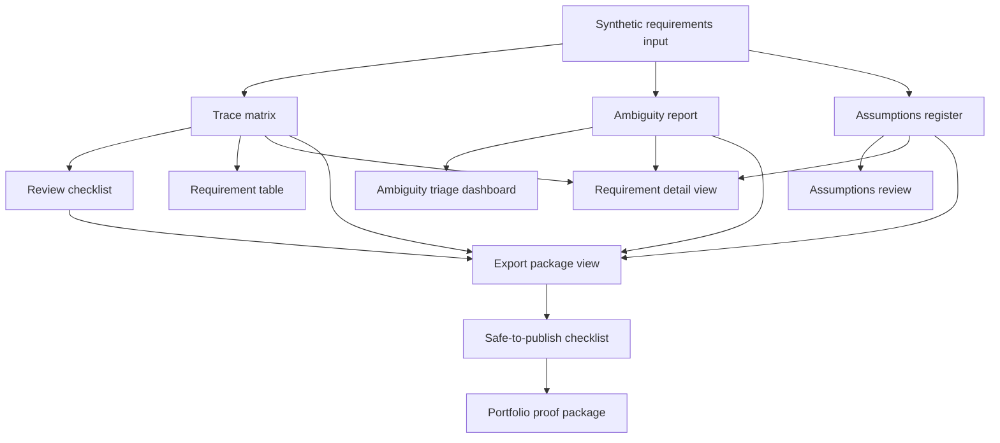

# Requirements-to-Verification UX Data Contract

[SYNTHETIC — FOR DEMONSTRATION ONLY]

> Human Review Required: AI-generated outputs are decision-support artifacts only. A qualified engineer owns final review and approval.

## Purpose

This data contract connects the existing deterministic Requirements-to-Verification outputs to the UX workflow, screen inventory, and review-state model. It is a workflow-design artifact only. It does not define app code, visual mockups, branding, colors, icons, or UI polish.

The contract answers four questions:

- What data came in?
- What did the tool infer or generate?
- What still needs human review?
- What can be included in an export or portfolio proof package?

## Source Artifacts

| Artifact | Current Path | Role In UX | Review Meaning |
|---|---|---|---|
| Synthetic requirements input | `../../Synthetic Requirements Sample.csv` | Source data for input preview, requirement table, and requirement detail view. | Must be confirmed synthetic or sanitized before use. |
| Trace matrix | `generated_outputs/trace_matrix.csv` and `generated_outputs/trace_matrix.md` | Primary row-level traceability source for requirement table, detail view, verification mapping, trace review, and export summary. | Generated trace rows are decision-support artifacts and remain review-owned. |
| Ambiguity report | `generated_outputs/ambiguity_report.csv` and `generated_outputs/ambiguity_report.md` | Issue source for ambiguity triage, requirement detail findings, and reviewer dashboard counts. | Every ambiguity issue must be dispositioned by a responsible engineer or reviewer. |
| Assumptions register | `generated_outputs/assumptions_register.csv` and `generated_outputs/assumptions_register.md` | Assumption source for assumption review and requirement detail links. | Assumptions remain draft until accepted, revised, rejected, or escalated. |
| Review checklist | `generated_outputs/review_checklist.csv` and `generated_outputs/review_checklist.md` | Readiness source for export package view and safe-to-publish checklist. | Checklist rows marked ready for review are not engineering approvals. |
| Run summary | `generated_outputs/run_summary.md` | Package-level status source for landing, export summary, and portfolio proof. | Publication classification remains `Needs review` until the publication gate passes. |
| Capture files | `captures/*.md` | Interview and portfolio proof support. | Captures should reflect reviewed workflow evidence and visible human-review boundaries. |

## Canonical UX Data Groups

| Data Group | Required Fields | Primary Source | Screen Consumers |
|---|---|---|---|
| Input provenance | Synthetic label, input file name, row count, required-column status, run marker. | Input CSV and run summary. | Project landing / run setup, input preview, export package view. |
| Requirement identity | `Requirement_ID`, source row reference, requirement text excerpt, subsystem or domain. | Input CSV and trace matrix. | Requirement table, requirement detail view, trace matrix review. |
| Generated interpretation | `Detected_Domain_Category`, `Verification_Method`, `Suggested_Verification_Evidence`, `Acceptance_Criteria`. | Trace matrix. | Requirement detail view, verification mapping view, trace matrix review. |
| Ambiguity findings | `Issue_Type`, `Trigger`, `Explanation`, `Recommended_Reviewer_Action`, `Severity`, `Human_Review_Status`. | Ambiguity report. | Ambiguity triage dashboard, requirement detail view, reviewer dashboard. |
| Assumption links | `Assumption_ID`, `Linked_Requirement_ID`, `Assumption_Statement`, `Rationale`, `Risk_If_Incorrect`, `Owner_Reviewer`, `Status`. | Assumptions register. | Assumptions review, requirement detail view, export package view. |
| Review checklist | `Check_ID`, `Review_Area`, `Checklist_Item`, `Status`, `Evidence`, `Reviewer_Notes`. | Review checklist. | Export package view, safe-to-publish checklist. |
| Publication controls | Synthetic label, human-review note, publication classification, safe-to-publish checklist result. | Run summary, trace matrix, review checklist, UX review states. | Export package view, safe-to-publish checklist, portfolio proof screens. |

## Screen-To-Artifact Contract

| Screen | Primary Artifacts | Required Data Shown | Review-State Rule | Portfolio Proof Note |
|---|---|---|---|---|
| Project landing / run setup | Input CSV, run summary. | Input file, output location, required schema fields, expected export artifacts, human-review note. | Starts as `Draft`; move to `Blocked` if input is not confirmed synthetic/sanitized or schema is incomplete. | Useful for showing controlled setup, but not the strongest proof screen. |
| Input preview | Input CSV. | Requirement IDs, text excerpts, schema status, row count, synthetic-data label. | `Draft` until the user confirms input suitability; `Blocked` if restricted details are found. | Shows source-to-output traceability. |
| Requirement table | Trace matrix, ambiguity report, assumptions register. | Requirement ID, text excerpt, domain, verification method, ambiguity count, assumption count, review state. | Rows with ambiguity or unresolved assumptions remain `Needs review`. | Can serve as the reviewer dashboard when grouped by review state. |
| Ambiguity triage dashboard | Ambiguity report, trace matrix. | Issue type, trigger, explanation, severity, recommended action, linked requirement. | Ambiguity issues cannot move beyond `Needs review` without reviewer disposition. | Best proof screen for ambiguity detection and human gates. |
| Requirement detail view | Trace matrix, ambiguity report, assumptions register. | Source requirement, generated interpretation, ambiguity findings, assumptions, verification suggestion, reviewer notes. | Detail view can show `Reviewed demo` only after assumption and ambiguity dispositions are recorded. | Best proof screen for traceability from input to human decision. |
| Assumptions review | Assumptions register. | Assumption ID, linked requirement, statement, rationale, risk if incorrect, owner/reviewer placeholder, status. | Open assumptions remain `Needs review`; missing owner/reviewer should be treated as `Blocked` for export readiness. | Shows assumption separation and review ownership. |
| Verification mapping view | Trace matrix, review checklist. | Verification method, suggested evidence, acceptance criteria, checklist item, reviewer notes. | Suggested mapping remains `Needs review` until a reviewer confirms or revises it. | Shows engineering verification thinking. |
| Trace matrix review | Trace matrix, ambiguity report, assumptions register. | Requirement ID, domain, verification method, evidence suggestion, acceptance criteria, unresolved issue indicators. | Trace rows are `Export ready` only when required fields are present and linked review issues are resolved for demo use. | Strong proof of traceability. |
| Export package view | All generated outputs, run summary. | Artifact list, row counts, unresolved review counts, publication classification, human-review note. | Package remains `Needs review` unless all included artifacts satisfy export criteria. | Best proof screen for export package summary. |
| Safe-to-publish checklist | Run summary, review checklist, export package view. | Synthetic label, human-review note, publication classification, restricted-detail screening result, final checklist result. | `Safe to publish` only after publication gate evidence is recorded. | Supports interview-safe governance discussion. |

## Current Status Normalization

| Current Output Value | UX Review State | Interpretation |
|---|---|---|
| `Needs review` | `Needs review` | Human review is required before engineering interpretation, export readiness, or publication. |
| `Ready for review` | `Needs review` | The generated item is available for review; it is not accepted or approved. |
| `TBD - qualified engineer review required` | `Needs review` | Reviewer ownership is explicitly pending. |
| `TBD - qualified engineer` | `Needs review` | Owner/reviewer placeholder is not a completed disposition. |
| Publication classification `Needs review` | `Needs review` | Public use is not yet cleared. |
| Reviewer accepts item for synthetic/demo use | `Reviewed demo` | Accepted for demo discussion only, not engineering approval. |
| Required evidence complete and no blockers remain | `Export ready` | Ready for package inclusion while retaining human-review language. |
| Publication gate passes | `Safe to publish` | Allowed for portfolio use after synthetic-data and confidentiality checks pass. |

## Row-Level Provenance Rules

Every row-level UX view must preserve:

- The source `Requirement_ID`.
- The generated artifact that produced the row.
- The synthetic-data label.
- The current review state.
- The human-review note or reviewer disposition field.
- A link or reference back to related ambiguity, assumption, verification, trace, or checklist records.

No generated interpretation should appear without its source requirement link and review state.

## Required Aggregations

| Aggregation | Source | Purpose |
|---|---|---|
| Requirement count | Input CSV or trace matrix. | Confirms how many rows entered the workflow and how many trace rows were generated. |
| Ambiguity count by issue type | Ambiguity report. | Drives ambiguity triage and reviewer dashboard prioritization. |
| Assumption count by linked requirement | Assumptions register. | Shows which requirements depend on unresolved assumptions. |
| Checklist status count | Review checklist. | Shows export readiness and open review areas. |
| Review-state count | Normalized output statuses and reviewer dispositions. | Shows what is draft, needs review, blocked, export ready, or safe to publish. |
| Publication blockers | Safe-to-publish checklist and run summary. | Prevents portfolio use until review controls pass. |

## Export Readiness Contract

An item can be marked `Export ready` only when:

- The source requirement ID is present.
- Generated interpretation has a linked source row.
- Ambiguity findings are dispositioned for demo use or explicitly excluded.
- Assumptions are dispositioned for demo use or explicitly excluded.
- Verification mapping is confirmed or marked as pending review.
- Human-review language remains attached to the export.
- The export package summary lists the artifact and unresolved review count.

`Export ready` does not mean engineering approval.

## Safe-To-Publish Contract

An artifact can be marked `Safe to publish` only when:

- It uses synthetic or sanitized automotive lighting examples.
- It includes `[SYNTHETIC — FOR DEMONSTRATION ONLY]` as visible synthetic labeling.
- It includes the human-review note.
- It does not include restricted organization, program, document, source-system, file-path, part, validation, cost, or private reviewer details.
- It does not imply AI approves requirements, verification methods, validation plans, or release decisions.
- It has a recorded publication classification and publication checklist result.

## Mermaid Data Flow

## Open Implementation Questions

- Should reviewer dispositions be stored in a separate review log, or added to generated output files after review?
- Should `Reviewed demo` require reviewer initials/date, or is a portfolio-safe run marker enough for the first UI version?
- Should blocked rows be excluded from exports by default, or exported with blocker reasons visible?
- Should the first UI read CSV/Markdown artifacts directly, or should the CLI generate a single normalized JSON package for the UI?
