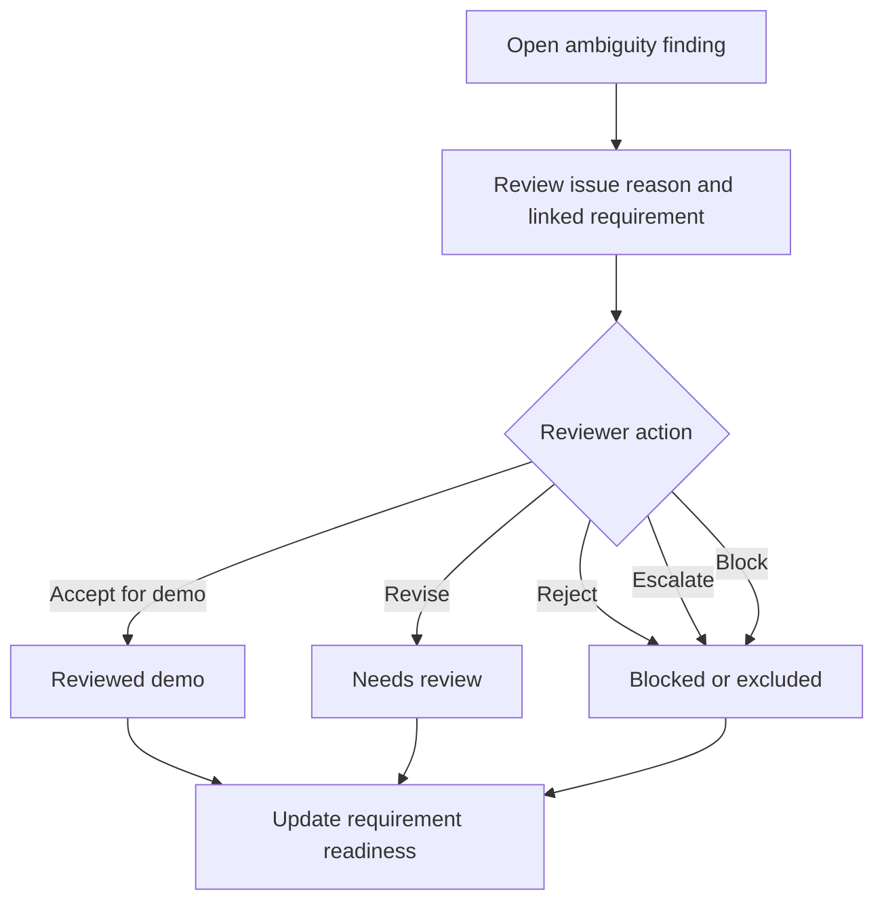

# Requirements-to-Verification UX Interaction Spec

[SYNTHETIC — FOR DEMONSTRATION ONLY]

> Human Review Required: AI-generated outputs are decision-support artifacts only. A qualified engineer owns final review and approval.

## Purpose

This interaction spec defines how a reviewer should move through the Requirements-to-Verification workflow using the existing UX workflow map, screen inventory, review states, and data contract.

The goal is workflow clarity: a reviewer should always know what came from the synthetic input, what the tool generated, what needs human review, what is blocked, and what is ready for export.

This document does not define app code, visual mockups, branding, colors, icons, or UI polish.

## Interaction Principles

- Keep original requirement text, generated findings, assumptions, verification suggestions, and reviewer decisions visually and logically separate.
- Never allow a generated suggestion to appear as engineering approval.
- Preserve `Requirement_ID` through every interaction.
- Make unresolved ambiguity, assumption, and verification issues impossible to miss.
- Require a reviewer disposition before a row can move from `Needs review` to `Reviewed demo`.
- Treat `Export ready` as package readiness only, not release readiness.
- Treat `Safe to publish` as a separate portfolio gate after export readiness.

## Interaction Objects

| Object | Source Artifact | Primary Review Question | Required Link |
|---|---|---|---|
| Requirement row | Input CSV and trace matrix | Is the requirement interpreted correctly for this synthetic workflow? | `Requirement_ID` |
| Ambiguity finding | Ambiguity report | Is the flagged issue valid, and what action should follow? | `Requirement_ID` |
| Assumption | Assumptions register | Is this assumption acceptable, revised, rejected, or escalated? | `Linked_Requirement_ID` |
| Verification mapping | Trace matrix and review checklist | Is the suggested method and evidence path acceptable for demo review? | `Requirement_ID` |
| Trace matrix row | Trace matrix | Is the requirement-to-verification path complete enough for export? | `Requirement_ID` |
| Export package | Generated outputs and run summary | Are artifacts complete, labeled, and review-state accurate? | Artifact list |
| Publication decision | Safe-to-publish checklist | Is the evidence safe for portfolio or interview discussion? | Publication classification |

## Action Vocabulary

| Action | Used For | Entry State | Resulting State | Required Evidence |
|---|---|---|---|---|
| Inspect | Any object | `Draft` or `Needs review` | No state change | Source artifact and linked requirement ID. |
| Confirm synthetic input | Input preview | `Draft` | `Needs review` | Input filename, row count, schema status, synthetic-data confirmation. |
| Accept for demo | Ambiguity, assumption, mapping, trace row | `Needs review` | `Reviewed demo` | Reviewer disposition, reviewer note, linked requirement ID. |
| Revise | Ambiguity response, assumption, mapping, reviewer note | `Needs review` or `Reviewed demo` | `Needs review` | Revised text, prior state, linked requirement ID. |
| Reject | Ambiguity, assumption, mapping | `Needs review` | `Blocked` or excluded from export | Rejection reason and affected artifact. |
| Escalate | Ambiguity, assumption, mapping | `Needs review` | `Blocked` | Escalation reason and required follow-up. |
| Block | Any object | Any state before `Safe to publish` | `Blocked` | Blocker reason and corrective action. |
| Return to review | Any edited object | `Reviewed demo`, `Export ready`, or `Safe to publish` | `Needs review` | Change reason and linked artifact. |
| Mark export ready | Trace row or package | `Reviewed demo` | `Export ready` | No unresolved required blockers; artifact membership recorded. |
| Clear publication gate | Export package | `Export ready` | `Safe to publish` | Synthetic label, human-review note, publication checklist result. |

## Screen Interaction Contracts

| Screen | Required User Action | System Response | Blocking Rule | Evidence Captured |
|---|---|---|---|---|
| Project landing / run setup | Confirm run target and expected artifacts. | Show schema requirements, output targets, and human-review note. | Block if run setup lacks input or output target. | Run marker, input path label, output package target. |
| Input preview | Confirm rows are synthetic or stop the run. | Show row count, required columns, and source requirement IDs. | Block if schema is incomplete or restricted details are visible. | Synthetic confirmation, row count, schema result. |
| Requirement table | Select rows needing review. | Show ambiguity count, assumption count, mapping status, and review state per row. | Keep rows in `Needs review` when unresolved flags exist. | Selected requirement ID and current state. |
| Ambiguity triage dashboard | Accept, revise, reject, escalate, or block each finding. | Update issue disposition and linked requirement state. | Block export for unresolved high-impact findings. | Issue type, trigger, disposition, reviewer note. |
| Requirement detail view | Review generated interpretation, linked issues, assumptions, and mapping. | Show full source-to-output chain for one requirement. | Prevent `Reviewed demo` if linked issues lack disposition. | Requirement ID, linked artifacts, decision note. |
| Assumptions review | Accept, revise, reject, escalate, or block assumptions. | Update assumption status and affected requirement readiness. | Block export if required assumptions remain unresolved. | Assumption ID, linked requirement, disposition. |
| Verification mapping view | Confirm, revise, reject, or defer method and evidence suggestions. | Update mapping state and checklist readiness. | Prevent `Export ready` when mapping is missing or rejected. | Method, evidence prompt, reviewer note. |
| Trace matrix review | Confirm trace completeness or send rows back to review. | Group rows by export readiness and unresolved issue count. | Block row export when source ID, mapping, or required disposition is missing. | Trace row, issue count, readiness state. |
| Export package view | Confirm package contents and unresolved review counts. | Generate package-level export readiness summary. | Keep package in `Needs review` if required rows are unresolved. | Artifact list, row counts, unresolved counts. |
| Safe-to-publish checklist | Confirm portfolio evidence is synthetic, review-labeled, and free of restricted details. | Mark package `Safe to publish` or return to review. | Block publication if any checklist item fails. | Checklist result, publication classification, blocker notes. |

## Ambiguity Finding Flow

1. Reviewer opens an ambiguity finding from the dashboard or requirement detail view.
2. System shows `Requirement_ID`, source text excerpt, `Issue_Type`, `Trigger`, `Explanation`, `Severity`, and `Recommended_Reviewer_Action`.
3. Reviewer selects one action: `Accept for demo`, `Revise`, `Reject`, `Escalate`, or `Block`.
4. System records the disposition and reviewer note.
5. If accepted for demo, the finding moves to `Reviewed demo`.
6. If revised, the finding remains `Needs review`.
7. If rejected, escalated, or blocked, the linked requirement cannot become `Export ready` until the blocker is resolved or the item is excluded from export.

## Assumption Review Flow

1. Reviewer opens an assumption from the assumptions review screen or requirement detail view.
2. System shows `Assumption_ID`, `Linked_Requirement_ID`, `Assumption_Statement`, `Rationale`, `Risk_If_Incorrect`, `Owner_Reviewer`, and `Status`.
3. Reviewer decides whether the assumption is acceptable for synthetic/demo use.
4. Accepted assumptions move to `Reviewed demo`.
5. Revised assumptions return to `Needs review`.
6. Rejected or escalated assumptions move to `Blocked` unless the affected requirement is excluded from export.
7. The linked trace matrix row cannot become `Export ready` while required assumptions remain unresolved.

## Verification Mapping Flow

1. Reviewer opens a mapping from the verification mapping view or requirement detail view.
2. System shows the source requirement, current `Verification_Method`, `Suggested_Verification_Evidence`, `Acceptance_Criteria`, and related checklist item.
3. Reviewer confirms, revises, rejects, or defers the mapping.
4. Confirmed mappings move to `Reviewed demo`.
5. Revised mappings remain `Needs review` until rechecked.
6. Rejected or missing mappings move the linked trace row to `Blocked`.
7. Confirmed mapping does not approve the requirement; it only supports export readiness for the synthetic review package.

## Trace Matrix Review Flow

1. Reviewer opens trace matrix review.
2. System groups trace rows by unresolved ambiguity count, unresolved assumption count, mapping status, and review state.
3. Reviewer inspects rows with unresolved items first.
4. Rows with all required dispositions can be marked `Export ready`.
5. Rows with unresolved review items remain `Needs review`.
6. Rows missing required source or mapping evidence move to `Blocked`.
7. Export package view must preserve blocked and unresolved counts.

## Export Readiness Flow

| Step | Reviewer Question | Required System Evidence | Allowed Outcome |
|---|---|---|---|
| 1 | Did every included row retain its source requirement ID? | Trace matrix row with `Requirement_ID`. | Continue or block. |
| 2 | Are ambiguity findings dispositioned or excluded? | Linked ambiguity status count. | Continue or return to ambiguity review. |
| 3 | Are assumptions dispositioned or excluded? | Linked assumption status count. | Continue or return to assumptions review. |
| 4 | Is verification mapping review complete enough for demo export? | Verification method, evidence prompt, reviewer note. | Continue or return to mapping review. |
| 5 | Does the package keep human-review language visible? | Human-review note in exports and summary. | Continue or block. |
| 6 | Are unresolved counts visible in the package summary? | Export package summary. | Mark `Export ready` or return to review. |

## Safe-To-Publish Flow

1. Reviewer opens the safe-to-publish checklist after export readiness is reached.
2. System shows synthetic-data labeling, human-review note, publication classification, artifact list, and unresolved blocker count.
3. Reviewer confirms no restricted details are visible.
4. Reviewer confirms the package does not imply AI approval.
5. Reviewer records checklist result.
6. Passing artifacts move to `Safe to publish`.
7. Failed artifacts move to `Blocked` or `Needs review` depending on whether the issue is safety-related or content-related.

## Required Evidence On Reviewer Actions

Every review action should capture:

- Object type.
- Linked `Requirement_ID` or artifact name.
- Prior state.
- New state.
- Reviewer disposition.
- Reviewer note.
- Blocker reason when applicable.
- Corrective action when applicable.
- Run marker or review marker.

For portfolio use, reviewer identity can remain a generic placeholder such as `qualified engineer reviewer` until a safe review record is defined.

## Guardrails

- Do not let a row reach `Reviewed demo` without a reviewer disposition.
- Do not let a row reach `Export ready` when required ambiguity or assumption issues remain unresolved.
- Do not let an export package hide blocked rows or unresolved counts.
- Do not let publication proceed without visible synthetic-data labeling and human-review language.
- Do not carry `Reviewed demo`, `Export ready`, or `Safe to publish` forward after edited content changes; return edited items to `Needs review`.
- Do not show restricted organization, program, source-system, document, file-path, part, validation, cost, or private reviewer details.

## Portfolio Proof Path

The strongest interview walkthrough is:

1. Start at the reviewer dashboard to show unresolved ambiguity, assumption, and mapping counts.
2. Open one requirement detail view to show source requirement, generated findings, assumptions, verification mapping, and reviewer decision field.
3. Move to ambiguity triage to show issue reason and human disposition.
4. Move to export package summary to show trace matrix, ambiguity report, assumptions register, review checklist, run summary, and unresolved review counts.
5. End at the safe-to-publish checklist to show governance and publication control.

This path demonstrates that AI accelerates the requirements-to-verification workflow while engineers own final judgment.

## Open Implementation Questions

- Should the first implementation store reviewer dispositions in a separate `review_log.csv`?
- Should the CLI generate a normalized JSON file for the future UI, or should the UI read current CSV outputs directly?
- Should export packages include blocked rows by default with blocker reasons, or require explicit reviewer selection?
- Should `Reviewed demo` require a reviewer marker before any portfolio screenshot is captured?
