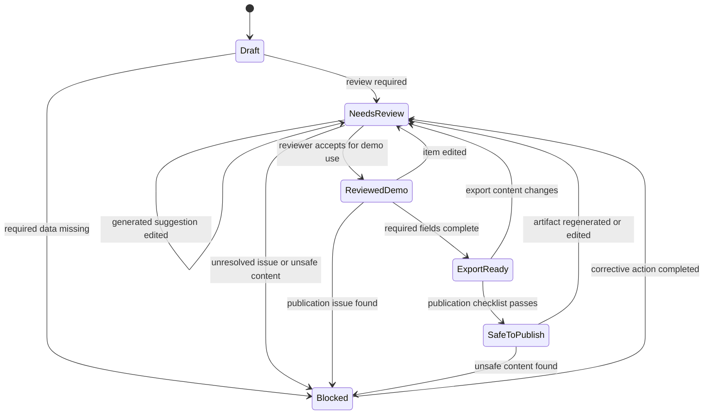

# Requirements-to-Verification Review States

[SYNTHETIC — FOR DEMONSTRATION ONLY]

> Human Review Required: AI-generated outputs are decision-support artifacts only. A qualified engineer owns final review and approval.

## Human Decision Gate Language

AI-generated suggestions are not engineering approval. Final requirement interpretation, verification method selection, and release decisions remain with the responsible engineer/reviewer.

## State Model Purpose

These states create a reusable review pattern for requirements, ambiguity findings, assumptions, verification mappings, trace rows, export packages, and portfolio publication checks.

The state model keeps tool output separate from human decision-making:

- The tool can generate draft findings.
- The tool can organize traceability and export artifacts.
- The engineer or reviewer owns interpretation, acceptance, rejection, escalation, and publication decisions.

## Review States

### Draft

- **Definition:** A generated or imported item exists, but no meaningful review has started.
- **Entry criteria:** Requirement row, ambiguity finding, assumption, verification mapping, trace row, or export artifact has been created or imported.
- **Exit criteria:** A reviewer opens the item and determines whether it needs clarification, revision, review, blocking, or export preparation.
- **Allowed user actions:** Inspect, filter, select, add reviewer note, send to `Needs review`.
- **Required evidence:** Source requirement ID, source row or input reference, synthetic-data label, creation or run marker.
- **Failure/risk condition:** Draft output is treated as accepted without review.
- **Example use in this project:** A newly generated trace matrix row before the engineer has inspected ambiguity and assumption flags.

### Needs Review

- **Definition:** The item needs qualified human review before it can be used for engineering interpretation or portfolio proof.
- **Entry criteria:** Ambiguity rule triggered, assumption generated, verification mapping suggested, missing field detected, or reviewer has not dispositioned the item.
- **Exit criteria:** Reviewer accepts for demo use, revises the item, rejects it, blocks it, or marks it ready for export.
- **Allowed user actions:** Accept for demo, revise, reject, escalate, assign review note, move to `Blocked`, move to `Reviewed demo`.
- **Required evidence:** Requirement ID, issue reason, suggested action, reviewer note or disposition field.
- **Failure/risk condition:** The item is exported as complete while ambiguity, assumption, or verification ownership is unresolved.
- **Example use in this project:** A requirement flagged for weak wording because it lacks a measurable limit or clear pass/fail criteria.

### Reviewed Demo

- **Definition:** A qualified reviewer has accepted the item for synthetic/demo portfolio use, not for production engineering approval.
- **Entry criteria:** Reviewer confirms the item is synthetic or sanitized, interpretation is acceptable for demo use, and human-review language remains visible.
- **Exit criteria:** Item moves to `Export ready`, returns to `Needs review` after edits, or is blocked if a publication or traceability issue is found.
- **Allowed user actions:** Add final reviewer note, include in export package, return to review if edited.
- **Required evidence:** Reviewer disposition, review date or run marker, linked requirement ID, retained synthetic-data label.
- **Failure/risk condition:** `Reviewed demo` is misread as released, validated, or approved engineering content.
- **Example use in this project:** A synthetic ambiguity finding is accepted as a valid portfolio example after reviewer inspection.

### Blocked

- **Definition:** The item cannot proceed because required information, review ownership, sanitization status, or traceability is missing.
- **Entry criteria:** Missing required field, unresolved assumption, unclear verification method, unsafe publication detail, broken source link, or reviewer rejects the item.
- **Exit criteria:** Required information is corrected, unsafe content is removed, reviewer disposition is added, or the item is excluded from export.
- **Allowed user actions:** Add blocker reason, revise input, remove unsafe detail, send back to `Needs review`, exclude from export.
- **Required evidence:** Blocker reason, linked requirement ID or artifact, required corrective action.
- **Failure/risk condition:** Blocked content appears in an export package or portfolio screenshot.
- **Example use in this project:** A requirement row has no verification method and no proposed test, so it cannot be marked export-ready.

### Export Ready

- **Definition:** The item is ready to be included in the generated review package, while still retaining the human-review boundary.
- **Entry criteria:** Required fields are present, ambiguity and assumption dispositions are resolved for demo use, traceability is intact, and no blockers remain.
- **Exit criteria:** Artifact is exported, edited and returned to `Needs review`, or moved to `Safe to publish` after publication review.
- **Allowed user actions:** Include in Markdown/CSV export, generate package summary, open generated artifact, return to review if changed.
- **Required evidence:** Source requirement ID, review state, artifact link, export package membership, unresolved issue count of zero for required gates.
- **Failure/risk condition:** Export readiness is mistaken for final engineering approval.
- **Example use in this project:** A trace matrix row with reviewed ambiguity status, reviewed assumption status, and confirmed verification mapping is included in the export package.

### Safe To Publish

- **Definition:** The item or artifact has passed the portfolio publication gate for synthetic/demo use.
- **Entry criteria:** Synthetic-data label is present, human-review language is present, no restricted details are visible, and publication classification is acceptable.
- **Exit criteria:** Artifact remains available for portfolio use, or returns to `Needs review` if edited, re-generated, or found to contain unsafe content.
- **Allowed user actions:** Use for portfolio screenshot, interview discussion, or public-safe artifact package.
- **Required evidence:** Safe-to-publish checklist result, artifact name, review note, publication classification, synthetic-data confirmation.
- **Failure/risk condition:** Public artifact includes nonpublic identifiers, implies AI approval, or lacks the human-review note.
- **Example use in this project:** An export package summary screenshot that shows synthetic labels, human-review controls, artifact list, and no restricted details.

## State Transition Table

| From State | Trigger | To State | Required Control |
|---|---|---|---|
| Draft | Reviewer opens item and review is required | Needs review | Source requirement ID and issue reason must be visible. |
| Draft | Required data missing before review | Blocked | Blocker reason must identify the missing field or traceability gap. |
| Needs review | Reviewer accepts item for synthetic/demo use | Reviewed demo | Reviewer disposition must be recorded. |
| Needs review | Reviewer identifies missing data, unsafe content, or unresolved traceability | Blocked | Corrective action must be recorded. |
| Needs review | Reviewer edits generated suggestion | Needs review | Edited item must remain under review until dispositioned. |
| Reviewed demo | Required export fields and links are complete | Export ready | Artifact membership and unresolved issue count must be visible. |
| Reviewed demo | Item is edited after review | Needs review | Prior review status must not carry over without re-review. |
| Reviewed demo | Publication issue is found | Blocked | Publication blocker must be recorded. |
| Blocked | Corrective action completed | Needs review | Reviewer must inspect the corrected item. |
| Export ready | Export package generated | Export ready | Export summary must retain human-review language. |
| Export ready | Publication checklist passes | Safe to publish | Synthetic label, human-review note, and publication classification must be present. |
| Export ready | Export content changes | Needs review | Changed content must be reviewed before reuse. |
| Safe to publish | Artifact is regenerated, edited, or challenged | Needs review | Publication review must be repeated. |
| Safe to publish | Unsafe content found | Blocked | Artifact must be removed from public evidence until corrected. |

## Mermaid State Diagram

## Reuse Notes For Other Portfolio Tools

- `Draft` should describe newly generated tool output.
- `Needs review` should describe items requiring engineer interpretation.
- `Reviewed demo` should be limited to synthetic/demo portfolio acceptance.
- `Blocked` should stop export or publication when traceability, review, or sanitization is incomplete.
- `Export ready` should mean package-ready, not engineering-approved.
- `Safe to publish` should require synthetic labeling, human-review language, and confidentiality screening.
