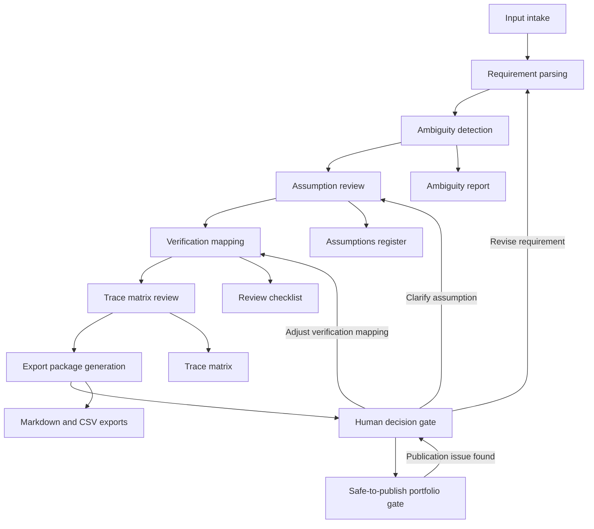

# Requirements-to-Verification UX Workflow Map

[SYNTHETIC — FOR DEMONSTRATION ONLY]

> Human Review Required: AI-generated outputs are decision-support artifacts only. A qualified engineer owns final review and approval.

## UX Principle

Can an engineer move from synthetic input -> reviewable output -> human decision point without confusion?

This workflow design is for Jose Orozco's Requirements-to-Verification Tool, a Codex-assisted engineering workflow tool for sanitized automotive lighting requirements. The UX is focused on workflow clarity, trust, traceability, review gates, and portfolio proof. It does not define visual styling, branding, colors, icons, or mockups.

## Primary Users

- Electrical engineer
- Design reviewer
- Validation engineer
- Portfolio interviewer

## Core Job

Review ambiguous requirements and generate a traceable verification package.

## Workflow Stages

| Stage | User Goal | System Action | Human Review Action | Output Artifact | Trust/Traceability Requirement |
|---|---|---|---|---|---|
| 1. Input intake | Load sanitized or synthetic automotive lighting requirements without exposing restricted details. | Accept the input CSV, show required schema fields, and identify missing required columns. | Confirm the input is synthetic or sanitized before processing. | Input preview and schema status. | Show source filename, row count, required-column status, and synthetic-data label. |
| 2. Requirement parsing | Understand what requirement rows are available for review. | Parse requirement ID, source type, requirement text, subsystem, requirement type, verification method, risk level, assumptions, ambiguity flag, proposed test, and human-review status. | Check that parsed fields preserve the input intent and do not introduce unsupported meaning. | Parsed requirement table. | Each parsed row must retain its original requirement ID and source row reference. |
| 3. Ambiguity detection | Quickly identify weak wording, missing limits, missing units, unclear context, or incomplete pass/fail criteria. | Apply deterministic ambiguity rules and tag each issue with a reason. | Decide whether each issue is valid, needs rewrite, or should remain open for engineering review. | Ambiguity report. | Every ambiguity flag must link back to the original requirement ID and rule reason. |
| 4. Assumption review | Separate inferred assumptions from confirmed requirement content. | Generate an assumptions register for rows with missing context, inferred conditions, or reviewer-dependent interpretation. | Accept, revise, reject, or escalate each assumption. | Assumptions register. | Assumptions must be marked as draft until reviewed; each assumption must link to a requirement ID. |
| 5. Verification mapping | Convert requirement rows into reviewable verification hooks. | Suggest verification method, proposed evidence, and checklist prompts based on deterministic rules and existing fields. | Confirm or change verification method, proposed test, evidence expectation, and acceptance criteria. | Verification mapping view and review checklist. | Tool suggestions must be labeled as suggestions, not approvals. |
| 6. Trace matrix review | Check whether each requirement has a traceable verification path. | Generate trace matrix rows linking requirement ID, subsystem, requirement type, verification method, ambiguity status, assumption status, and review status. | Confirm trace completeness and mark rows that need further engineering action. | Trace matrix. | Trace rows must preserve source requirement IDs and show unresolved review flags. |
| 7. Export package generation | Produce a reviewable package for engineering discussion or portfolio evidence. | Export Markdown and CSV artifacts for trace matrix, ambiguity report, assumptions register, review checklist, and run summary. | Confirm exported artifacts are complete, synthetic, and still marked for human review where needed. | Export package. | Export summary must show artifact list, generation date or run marker, row counts, and review status. |
| 8. Human decision gate | Decide what is ready for review discussion, what needs rewrite, and what is blocked. | Group outputs by review state and highlight unresolved ambiguity, assumption, and verification gaps. | Own final requirement interpretation, verification method selection, and decision on next action. | Human decision summary. | AI-generated suggestions are decision-support only; final decision ownership must stay visible. |
| 9. Safe-to-publish portfolio gate | Decide whether screenshots and artifacts are safe for interview or portfolio use. | Present a publication checklist for synthetic labels, human-review notes, unresolved risks, and restricted-detail screening. | Confirm no restricted details are present and mark public evidence as safe only after review. | Safe-to-publish checklist. | Portfolio proof must show synthetic-data label, human-review note, and publication classification. |

## Mermaid Flowchart

## UX Success Test

A reviewer should be able to tell what came in, what the tool inferred, what needs human review, and what is ready for export.

The workflow succeeds when:

- The original synthetic input rows remain traceable through every output.
- Ambiguity flags explain why review is needed.
- Assumptions are visibly separate from confirmed requirement content.
- Verification method suggestions remain editable and review-owned.
- Export readiness is blocked until required review controls are visible.
- Portfolio screenshots can show the workflow without exposing restricted engineering details.
